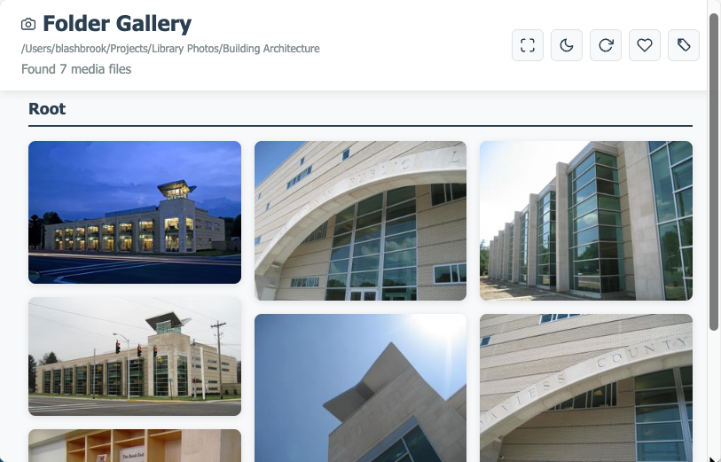

[Home](README.md) | [Installation](docs/installation.md) | [CLI](docs/cli.md) | [Server](docs/server.md) | [Video thumbnails](docs/video-thumbnails.md) | [Troubleshooting](docs/troubleshooting.md)

# Folder Gallery

A simple, fast CLI tool to turn any folder of photos and videos into a beautiful, responsive web gallery.

- One command: `gallery up`
- Caches thumbnails, watches for changes, and serves instantly
- Works great for large folders; runs in the background so your terminal is free

---

## Quick Start

1) Install globally
```bash
npm install -g folder-gallery
```

**Note**: If Sharp (image processing library) fails to install, the gallery will still work but without thumbnail generation. To enable thumbnails:
```bash
# Install Sharp separately if the main install failed
npm install -g sharp
```

2) Start a gallery in any folder
```bash
cd /path/to/photos
gallery up
```

3) Open in your browser (auto-opens by default)
- Default URL: http://localhost:3000

4) What you’ll see



Tip: Use `gallery up -d /path/to/photos --port 3000` to start on a specific path/port.

---

## Common Commands

```bash
# Start in the current directory
gallery up

# Start in a specific directory
gallery up -d /path/to/images

# Use a custom port
gallery up --port 8080

# Don’t auto-open the browser
gallery up --no-open

# Stop all gallery servers
gallery down

# Force a rescan of the current gallery
gallery rescan
```

---

## What you get
- ✅ Recursively scans images and videos
- ✅ Generates cached thumbnails (prioritized for visible items)
- ✅ Watches for file changes in real-time
- ✅ Runs detached so your terminal is free

---

## Need details?
- Install notes, platform requirements, and optional tools like FFmpeg: docs/installation.md
- Flags like `--max-workers`, `--ffmpeg-timeout`, `--disable-video-thumbs`: docs/video-thumbnails.md
- Full CLI reference and examples: docs/cli.md
- How the server, cache, and UI work: docs/server.md
- Common issues and fixes: docs/troubleshooting.md

✨ **Modern Web Interface**
- Organized gallery with folder sections
- Viewport-aware thumbnail generation (prioritizes visible images)
- Pause/resume thumbnail generation at any time
- Real-time thumbnail generation with progress bar
- Instant tiny preview thumbnails for immediate feedback
- Pan and zoom functionality for images
- Video playback support
- Favorite/heart images with persistent storage
- Filter to show only favorited images
- **Search images by filename or folder name (Ctrl/Cmd+K)**
- Fullscreen mode and dark/light theme toggle
- Responsive design for all devices

🚀 **Easy to Use**
- Global CLI installation
- Automatic port detection
- Browser auto-launch
- Recursive directory scanning

📱 **Media Support**
- **Images**: JPG, PNG, GIF, BMP, WebP, TIFF, SVG
- **Videos**: MP4, MOV, AVI, MKV, WebM, OGG, M4V, 3GP, WMV, FLV

## System Requirements

### **Minimum Requirements:**
- **Node.js**: 18.0.0 or higher
- **npm**: 6.0.0 or higher (usually bundled with Node.js)
- **Operating System**: 
  - macOS 10.13+ (High Sierra)
  - Linux (Ubuntu 18.04+, CentOS 7+, or equivalent)
  - Windows 10+ (with PowerShell 3.0+)
- **Memory**: 512MB RAM minimum, 1GB+ recommended for large galleries
- **Storage**: 50MB for application + additional space for thumbnail cache

### **Platform-Specific Dependencies:**

#### **Linux:**
- **Build tools**: `build-essential` (Ubuntu/Debian) or `gcc-c++` (CentOS/RHEL)
- **Python**: 3.x (for Sharp native compilation)
- **Additional packages**: May need `libvips-dev` for Sharp optimization
- **FFmpeg** (Optional): For real video thumbnails from frame extraction
  - Install: `sudo apt-get install ffmpeg` (Ubuntu/Debian) or `sudo yum install ffmpeg` (CentOS/RHEL)

#### **macOS:**
- **Xcode Command Line Tools**: Required for Sharp compilation
- Install with: `xcode-select --install`
- **tag CLI tool** (Optional): For Finder tags support in gallery UI
  - Install: `brew install tag`
  - Enables reading and writing Finder tags from the gallery
  - Gallery works without it, but tag features will be disabled
- **FFmpeg** (Optional): For real video thumbnails from frame extraction
  - Install: `brew install ffmpeg`

#### **Windows:**
- **Visual Studio Build Tools** or **Visual Studio 2019+**
- **Python**: 3.x (for Sharp native compilation)
- **PowerShell**: 3.0+ (Windows 10+ includes 5.1+)
- **FFmpeg** (Optional): For real video thumbnails from frame extraction
  - Download from: https://ffmpeg.org/download.html
  - Or install via: `choco install ffmpeg` (if using Chocolatey)

### **Supported Image Formats:**
- **Images**: JPEG, PNG, GIF, BMP, WebP, TIFF, SVG
- **Videos**: MP4, MOV, AVI, MKV, WebM, OGG, M4V, 3GP, WMV, FLV

### **Performance Considerations:**
- **Viewport-Aware Generation**: 
  - Only generates thumbnails for visible images first
  - Automatically prioritizes as you scroll
  - Reduces initial wait time for large galleries
  - Background generation continues for off-screen images
- **Two-Phase Thumbnail Generation**: 
  - Phase 1: Instant 64×64 tiny previews (blurred) for viewport items
  - Phase 2: Full 300×300px thumbnails
- **Adaptive Batch Processing**: 
  - Processes 5 items at a time with viewport priority
  - Viewport items: Tiny preview → Full thumbnail
  - Background items: Full thumbnail only
- **User Control**:
  - Pause/resume thumbnail generation at any time
  - Gallery remains fully usable while paused
  - Resume exactly where you left off
- **Thumbnail Size**: 300×300px JPEG (quality 80%) + 64×64px tiny preview
- **Cache Size**: ~10-50KB per full thumbnail + ~2KB per tiny preview
- **Memory Usage**: ~100-200MB base + ~1-2MB per 1000 images
- **CPU Usage**: Moderate during initial thumbnail generation, minimal during serving
- **Progressive Loading**: Server-Sent Events (SSE) for real-time thumbnail updates

### **Video Thumbnail Handling:**
- **With FFmpeg installed**: Real frame extraction from videos
  - Extracts a representative frame at roughly 1/3 of the video duration
  - Creates accurate video thumbnails showing actual content
  - Maintains aspect ratio with padding when necessary
- **Without FFmpeg**: Graceful fallback to placeholder thumbnails
  - Video thumbnails display a generic play button icon
  - Gallery remains fully functional
  - Video playback still works normally
  - No error messages or logging; seamless experience

### **Network Requirements:**
- **Local Network**: Gallery accessible on local network by default
- **Port Range**: 3000-3099 (automatic port selection if 3000 in use)
- **Bandwidth**: Minimal - thumbnails cached locally, full images served on-demand

## Installation Feedback

After installation, the postinstall script displays:
- 🎉 **Styled installation banner** confirming successful setup
- ✅ **Dependency status** for Sharp (image processing) and macOS tag CLI
- 🚀 **Quick start instructions** to get your first gallery running
- ⚠️ **Installation guidance** if optional dependencies are missing

**Example postinstall output:**
```
╬════════════════════════════════════════════════════════════╩
║  📸 Folder Gallery - Installed Successfully               ║
╙════════════════════════════════════════════════════════════╜

👤 Created by Brian Lashbrook
📖 View Docs: https://github.com/blashbrook/folder-gallery#readme

✅ Sharp: Image thumbnails enabled
✅ macOS tag: Finder tags enabled  (macOS only)

🚀 Quick Start:
   cd /path/to/photos
   gallery up
```

## Alternative Installation Methods

### Minimal package vs dev extras
- The published npm package only includes runtime files (CLI, server, core JS). Docs, tests, and non-essential assets are excluded.
- Dev extras are gated behind a postinstall that only runs when explicitly requested.

Dev-only postinstall:
```bash
# Force dev setup tasks locally (no-op placeholder)
npm run local-install
# Or set env before install
FG_DEV=1 npm install
```

### 📦 From Source (Development)

If you want to install from source or contribute to development:

```bash
# Clone the repository
git clone https://github.com/blashbrook/folder-gallery.git
cd folder-gallery

# Install dependencies
npm install

# Link globally for development
npm link
```

### 🔗 Development Workflow

```bash
# Link local version for testing
npm run link

# Make your changes...

# Unlink when done
npm run unlink
```

### 🗑️ Uninstall

```bash
npm uninstall -g folder-gallery
```

## CLI Commands Reference

### Start Gallery Server
```bash
# Start server in current directory
gallery up

# Start server for specific directory
gallery up -d /path/to/images

# Use custom port
gallery up --port 8080

# Don't open browser automatically
gallery up --no-open
```

### Scan Directory (Preview)
```bash
# Scan current directory and show results
gallery scan

# Scan specific directory
gallery scan -d /path/to/images
```

### Stop Servers
```bash
# Stop all running gallery servers
gallery down
```

### Force Rescan
```bash
# Force rescan of current directory gallery
gallery rescan
```

### Clean Up Orphaned Thumbnails
```bash
# Remove thumbnails for deleted media files
gallery cleanup
```

### Clean Up Cache Files
```bash
# Delete all .gallery-cache directories (with confirmation)
gallery delete

# Delete cache files in specific directory
gallery delete -d /path/to/clean

# Force delete without confirmation
gallery delete -f
```

## Legacy Server Mode

For development or if you prefer not to use the CLI:

```bash
# Clone and install dependencies
git clone https://github.com/blashbrook/folder-gallery.git
cd folder-gallery
npm install

# Run standalone server
npm start

# Or specify directory
node server.js /path/to/images

# Development mode with auto-restart
npm run dev
```

## How It Works

Important: All gallery HTML, CSS, and client-side JS are generated at runtime by JavaScript. There are no static HTML files shipped with the package. The key generators are:
- bin/server-runner.js → generateIndexHTML(): writes .gallery-cache/index.html with embedded CSS/JS and all UI
- bin/server-runner.js → thumbnail pipeline: generates .gallery-cache/thumbnails/*.jpg using Sharp (and FFmpeg optionally)
- bin/gallery.js → CLI: spawns server-runner in the background, manages PID and server-info.json

1. **Scanning**: Recursively scans directories for images and videos
2. **Thumbnails**: Automatically generates optimized thumbnails
3. **Caching**: Stores thumbnails in `.gallery-cache` directories
4. **Serving**: Provides a responsive web interface with advanced features
5. **File Watching**: Automatically detects new/deleted files
6. **Smart Caching**: Caches scan results for fast loading

## ⚡ Performance & Caching

### **Intelligent Caching System:**
- **📋 File Listings**: Cached for 30 seconds for instant loading
- **🖼️ Thumbnails**: Generated once and cached permanently
- **👀 File Watching**: Auto-detects new/deleted files and invalidates cache
- **🔄 Manual Refresh**: Use `gallery rescan` or click "Rescan" button

### **Optimizations:**
- **Background Processing**: Server runs detached, no terminal blocking
- **Lazy Thumbnails**: Only generated when requested
- **Smart Invalidation**: Cache updates only when files change
- **Efficient Scanning**: Skips hidden directories and irrelevant files

### **Cache Behavior:**
- **Server Restart**: ❌ Not needed - file watching handles new files automatically
- **New Files**: ✅ Detected automatically via file watching
- **Cache Location**: `.gallery-cache/` in each scanned directory
- **Cache Cleanup**: Use `gallery delete` to remove cache files

## API Endpoints

### Get Gallery Data
```
GET /api/gallery
```
Returns JSON with all images organized by directory structure.

### Server-Sent Events (SSE)
```
GET /progress
```
Real-time thumbnail generation progress and updates:
- `request_viewport_items`: Server requests visible items from client
- `tiny_preview_ready`: When 64×64 preview is generated
- `thumbnail_ready`: When full 300×300 thumbnail is complete
- `global_thumbnail_progress`: Overall progress with current file
- `thumbnail_paused`: When generation is paused/resumed

### Force Rescan
```
POST /api/rescan
```
Invalidates cache and rescans directory for new files.

### Report Viewport Items
```
POST /api/viewport-items
```
Client reports which images are currently visible in viewport.
Payload: `{ relativePaths: string[] }`

### Pause/Resume Thumbnail Generation
```
POST /api/pause-thumbnails
```
Toggles pause state for thumbnail generation.
Returns: `{ isPaused: boolean }`

### View Individual Image
```
GET /image/:path
```
Serves the full-resolution image file.

### Static Files
```
GET /static/*
```
Serves thumbnails and cached files from `.gallery-cache/`.

## Directory Structure

At runtime (per scanned directory):

```
/path/to/photos/
├── .gallery-cache/
│   ├── index.html          # Generated by bin/server-runner.js (generateIndexHTML)
│   ├── thumbnails/         # Generated thumbnails (*.jpg)
│   ├── gallery.pid         # Server PID for process management
│   └── server-info.json    # Port and runtime info for CLI open/attach
└── <your media files>
```

Source layout (repo):

```
folder-gallery/
├── bin/
│   ├── gallery.js         # CLI: up/down/scan/delete, spawns server-runner
│   └── server-runner.js   # Background server; generates .gallery-cache and UI
├── server.js              # Legacy standalone server (dev/back-compat)
├── metadata.js            # Metadata utilities
├── macos-tags.js          # macOS Finder tags integration
├── package.json
└── docs/
```

## Configuration

### Environment Variables
- `PORT`: Server port (default: 3000)
- `TAG_PATH`: Path to the `tag` CLI tool (default: `/opt/homebrew/bin/tag`)
  - Only used on macOS for Finder tags functionality
  - Set this if `tag` is installed in a non-standard location

### Command Line Arguments
- First argument: Directory to scan (default: current directory)

#### Video thumbnail options (CLI)
- `--max-workers <n>`: Limit concurrent FFmpeg extractions (default: 2)
- `--ffmpeg-timeout <ms>`: Per-file FFmpeg timeout in milliseconds (default: 20000)
- `--disable-video-thumbs`: Disable real video frames (always use placeholder)

### Examples

```bash
# Scan current directory on port 3000
npm start

# Scan specific directory
node server.js ~/Pictures

# Use different port
PORT=8080 node server.js /path/to/images
```

## Features in Detail

### Thumbnail Generation
- **Viewport-aware generation**:
  - Prioritizes thumbnails for images currently visible on screen
  - Automatically detects and prioritizes as you scroll (500px buffer)
  - Background generation continues for off-screen images
- **Two-phase generation** for optimal UX:
  1. Instant tiny previews (64×64) appear immediately for viewport items
  2. Full-quality thumbnails (300×300) load progressively
- **Pause/Resume control**:
  - Pause button replaces rescan button during generation
  - Click to pause/resume at any time
  - Gallery remains fully usable while paused
  - Icon changes: ⏸️ (pause) ↔️ ▶️ (resume)
- **Real-time progress**: Slim progress bar in header with current file name
- **Individual loaders**: Spinner on each thumbnail during generation
- Uses Sharp for high-quality, fast image processing
- Thumbnails are cached and only regenerated if missing
- JPEG format with 80% quality for optimal file size

### Favorites System
- **Heart/favorite images**: Click heart icon on any image
- **Persistent storage**: Favorites saved in browser localStorage
- **Filter view**: Toggle to show only favorited images
- **Multiple interfaces**:
  - Gallery view: Heart button appears on hover (top-right)
  - Modal view: Heart button in zoom controls
  - Header: Filter button to show only favorites
- **Visual feedback**: Red filled heart when favorited, outline when not

### Security Features
- Path traversal protection prevents access to files outside scan directory
- Only serves files with supported image extensions
- Base64-encoded filenames prevent filename conflicts

### Performance
- Lazy loading for thumbnails
- Efficient caching of generated thumbnails
- Asynchronous directory scanning
- Minimal memory footprint

### Mobile Support
- Responsive column layout (2-5 columns based on screen size)
- Touch-friendly image previews
- Optimized for various screen sizes
- Progressive loading with tiny previews for faster initial display
- Efficient loading on mobile networks

### User Interface Controls
- **Header Buttons**:
  - Fullscreen: Toggle fullscreen mode
  - Search: Filter images by filename or folder name (Ctrl/Cmd+K)
  - Theme: Switch between dark and light themes
  - Pause/Resume: Pause or resume thumbnail generation (only visible during generation)
  - Rescan: Force directory rescan (hidden during generation)
  - Favorites Filter: Show only hearted images (highlights red when active)
- **Keyboard Shortcuts**:
  - `Ctrl+K` or `Cmd+K`: Open/close search
  - `Escape`: Close search or modal
  - `Arrow Left/Right`: Navigate images in modal view
- **Modal Controls** (Image Viewer):
  - Heart: Favorite/unfavorite current image
  - Zoom In/Out: Control image zoom level
  - Reset: Return to 100% zoom
  - Close: Exit modal (or press ESC)
- **Gallery View**:
  - Heart icon on hover: Favorite images directly from gallery
  - Click image: Open in full-screen modal
  - Organized by folder sections with titles
  - Automatic viewport detection for optimized loading

## Troubleshooting

### System Requirements Issues

**Q: Installation fails with "Node.js version too old" error**
- Update Node.js to 18.0.0 or higher from [nodejs.org](https://nodejs.org/)
- Verify version: `node --version`

**Q: Sharp installation fails on Linux**
- Install build tools: `sudo apt-get install build-essential python3-dev` (Ubuntu/Debian)
- Or: `sudo yum install gcc-c++ python3-devel` (CentOS/RHEL)
- For better performance: `sudo apt-get install libvips-dev`

**Q: "gyp ERR!" during installation on Windows**
- Install Visual Studio Build Tools or Visual Studio with C++ tools
- Alternative: Install windows-build-tools: `npm install -g windows-build-tools`
- Ensure Python 3.x is installed and in PATH (for Sharp native compilation)

**Q: Sharp installation fails on macOS**
- Install Xcode Command Line Tools: `xcode-select --install`
- Update macOS to latest version if using older hardware
- For Apple Silicon Macs: Ensure Node.js is ARM64 version

**Q: "Permission denied" errors during installation**
- On macOS/Linux: Use `sudo` or configure npm for global installs without sudo
- Configure npm: `npm config set prefix ~/.local` and add `~/.local/bin` to PATH
- On Windows: Run PowerShell as Administrator

**Q: Gallery server won't start**
- Check Node.js version: `node --version` (must be 18+)
- Verify port availability: `netstat -an | grep 3000`
- Check file permissions in installation directory

### Common Issues

**Q: Images aren't showing up**
- Ensure image files have supported extensions
- Check file permissions
- Verify the directory path is correct

**Q: Thumbnails not generating**
- Sharp may need additional dependencies on some systems
- Check console for thumbnail generation errors
- Ensure write permissions to `static/thumbnails/` directory

**Q: Server won't start**
- Check if port 3000 is already in use
- Try a different port: `PORT=8080 npm start`
- Ensure Node.js version 18+ is installed

### Error Messages
- `Unable to scan directory`: Check directory permissions and path
- `Failed to generate thumbnail`: Image file may be corrupted or unsupported format
- `Access denied`: File is outside the scan directory (security protection)

## Development

### Requirements
- Node.js 18.0.0 or higher
- npm or yarn package manager

### Dependencies
- **express**: Web server framework
- **sharp**: High-performance image processing
- **multer**: File upload handling (for future features)

### Contributing
1. Fork the repository
2. Create a feature branch
3. Make your changes
4. Test thoroughly
5. Submit a pull request

## License

MIT License - feel free to use this project for personal or commercial purposes.

## Changelog

### v1.0.0
- Initial release
- Basic gallery functionality
- Thumbnail generation
- Responsive design
- Directory organization
- Metadata support framework

## Commands Quick Reference

| Command | Description | Example |
|---------|-------------|----------|
| `gallery up` | Start server | `gallery up -d ~/Photos` |
| `gallery up --port <n>` | Use custom port | `gallery up --port 8080` |
| `gallery up --no-open` | Don't open browser | `gallery up --no-open` |
| `gallery down` | Stop all servers | `gallery down` |
| `gallery scan` | Preview scan results | `gallery scan -d ~/Documents` |
| `gallery rescan` | Force rescan files | `gallery rescan` |
| `gallery cleanup` | Clean orphaned thumbnails | `gallery cleanup` |
| `gallery delete` | Clean cache files | `gallery delete -f` |
